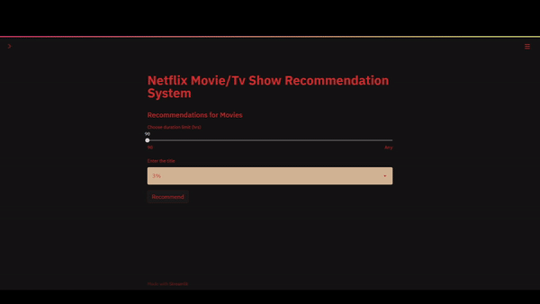

# Content Based Recommendation system for titles in OTT based service platform "Netflix"

Recommendation system is created for the content present on Netflix. Tags are created with various methods in text pre - processing and then are vectorized by TF-IDF methodology. Web application was created with the help of Streamlit. The user is allowed to choose between type of content on Netflix and also given the choice to limit the duration of the recommended content. 


## Demo




  
## API Reference

#### Getting posters for recommended content

```
GET /find/{external_id}
```

```
https://api.themoviedb.org/3/find/{external_id}?api_key=<<api_key>>&language=en-US&external_source=imdb_id
```

| Parameter | Type     | Description                |
| :-------- | :------- | :------------------------- |
| `api_key` | `string` | **Required**. Your API key
| `imdb_id`  | `string` | **Required**. Imdb ID for your content


  
## Deployment

Project is deployed to heroku.

[Link to deployed Project](https://nflix-recsys-saurabh.herokuapp.com/)

  
## Dataset Used

https://www.kaggle.com/shivamb/netflix-shows

  
## Files in repository

- moviepage.py - Python file with code for generating and displaying Movie recommendations. 
- tvpage.py - Python file with code for generating and displaying Tv show recommendations.
- final_app.py - Python file to run while deployment
- Data pre-processing.ipynb - Python notebook where the raw data is modified and made ready for project requirement.
- Demo - Screenshots and demo gif of the project.

  